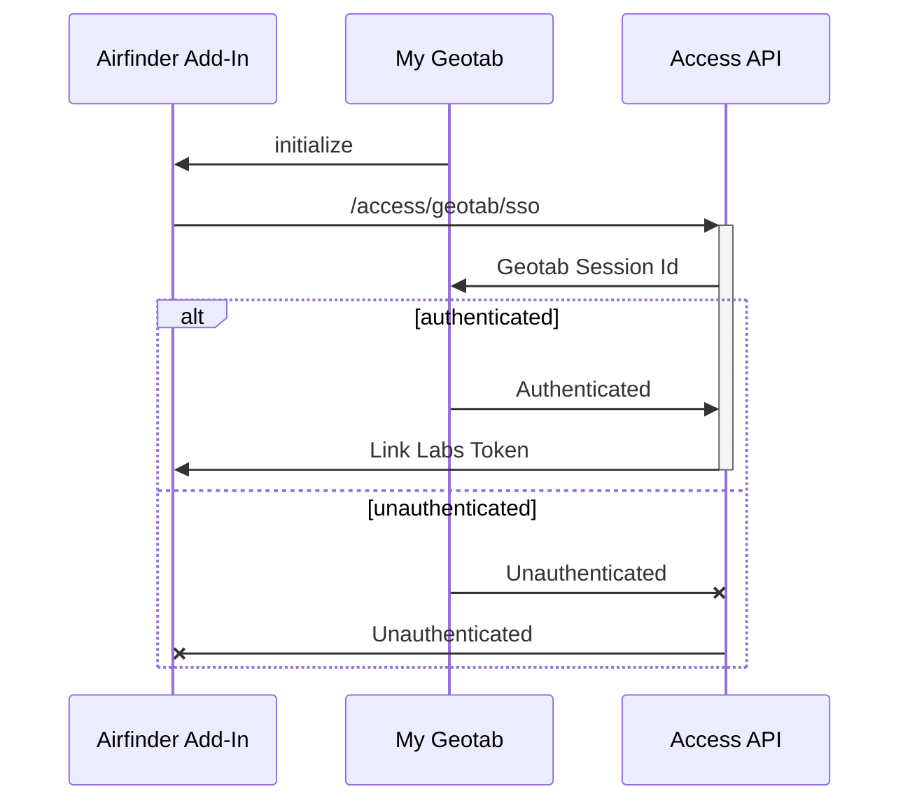
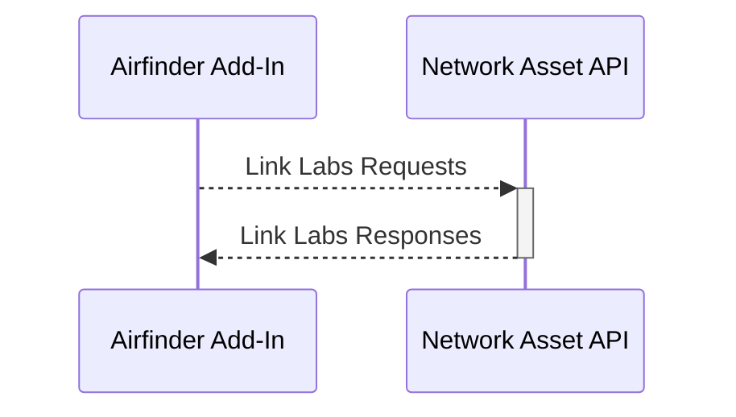

# Airfinder Add-In

URL: https://geotab.link-labs.com

## SSO Process

Access API: https://access-conductor.link-labs.com

## Link Labs Data

Network Asset API: https://networkasset-conductor.link-labs.com

- GET: Airfinder Organizations (`/networkAsset/airfinder/organizations`)
- GET: Airfinder Sites
  - `/networkAsset/airfinder/sites`
  - `/networkAsset/airfinder/organization/${organizationId}/sites`
- GET: Airfinder Tags (`/networkAsset/airfinder/v4/tags?${params}`)

